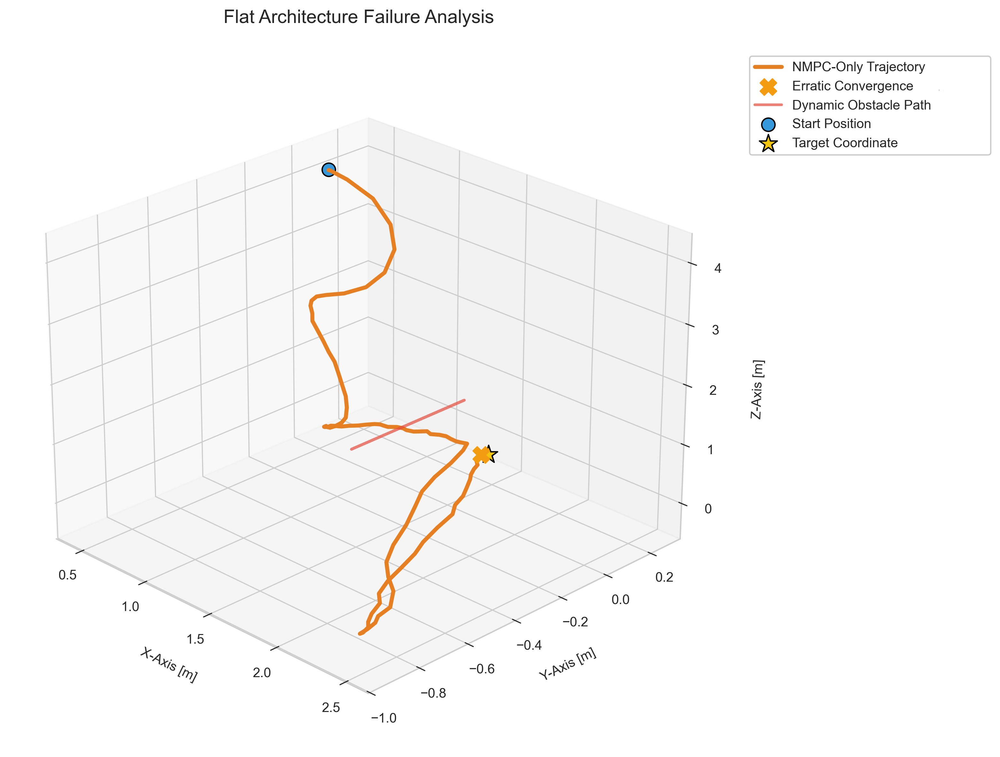
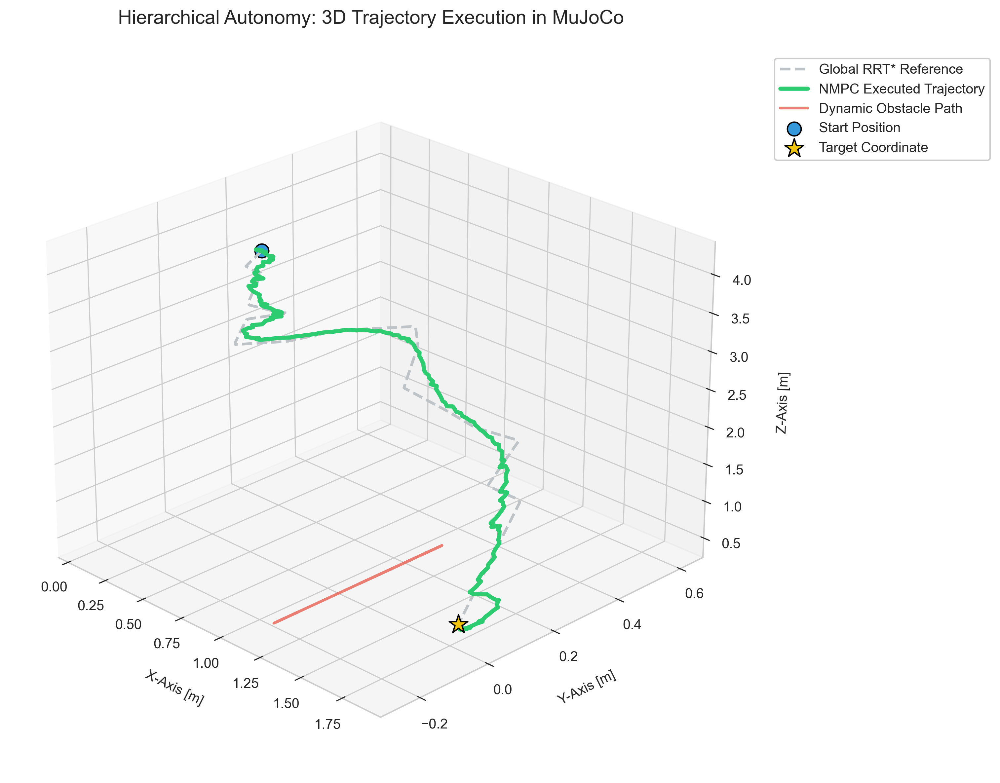
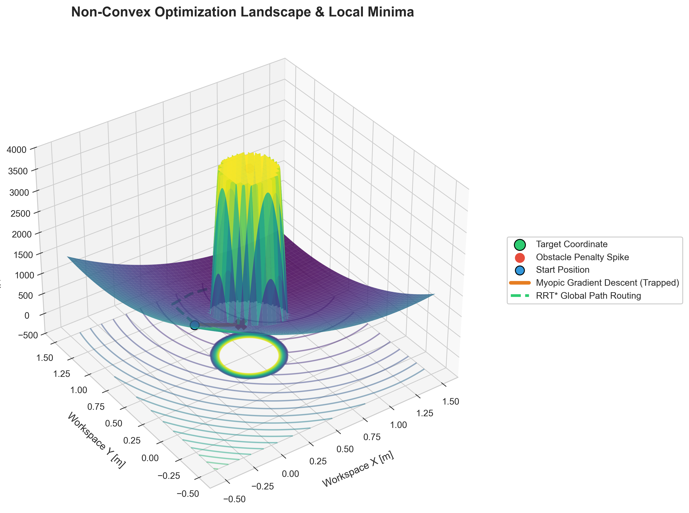

## Table of Contents
* [Project Overview](#project-overview)
* [File Structure](#file-structure)
* [1. Motivation & Project Evolution](#1-motivation--project-evolution)
* [2. Algorithmic Layers](#2-algorithmic-layers)
  * [1. High-Level Planning: 3D Cartesian RRT*](#1-high-level-planning-3d-cartesian-rrt)
  * [2. Nonlinear Model Predictive Controller (NMPC)](#2-nonlinear-model-predictive-controller-nmpc)
  * [3. Low-Level Estimation: Unscented Kalman Filter (UKF)](#3-low-level-estimation-unscented-kalman-filter-ukf)
* [3. Whole-Body Collision Avoidance (Virtual Nodes)](#3-whole-body-collision-avoidance-virtual-nodes)
* [4. Algorithmic Performance Trade-offs](#4-algorithmic-performance-trade-offs)
* [5. Future Work](#5-future-work)

## Project Overview

This project simulates a 4 Degree-of-Freedom (4-DOF) robotic arm in the MuJoCo physics engine. It implements a complete Hierarchical Autonomy Stack combining global sampling-based motion planning with real-time local optimal control and state estimation:  

* High-Level Global Planner: A 3D Cartesian Rapidly-exploring Random Tree Star (RRT*) computes a collision-free geometric trajectory around macro-environmental boundaries.
* Mid-Level Local Controller: A custom-built Nonlinear Model Predictive Controller (NMPC) powered by CasADi tracks time-indexed reference windows along the RRT* path while proactively dodging highly dynamic, swinging obstacles.  
* Low-Level Estimator: An Unscented Kalman Filter (UKF) filters out injected Gaussian sensor noise to provide clean state estimates to the optimization loop in real time.  The system demonstrates advanced whole-body optimal control, randomized motion planning, and stochastic state estimation operating together in a high-fidelity simulated hardware environment.

## File Structure
* main.py - The core orchestrator loop. It updates MuJoCo physics, triggers the global RRT* planner, injects Gaussian sensor noise, runs the UKF pipeline, and closes the loop at 50Hz by feeding time-indexed path windows into the NMPC.  
* planner.py - Implements the high-level 3D Cartesian RRT* planner and a dynamic waypoint interpolator/slicer to generate smooth preview reference paths for the receding horizon loop.
* controller.py - Contains the CasADi optimization logic. Defines explicit state-space dynamics, cost profiles tracking the time-indexed path slice, and non-linear, whole-body collision avoidance manifolds.  
* filter.py - The state estimation module. Uses deterministic sigma points via an Unscented Kalman Filter (UKF) to filter noisy joint positions and velocities.  
* Kinematic.py - The kinematic engine handling symbolic forward kinematics used by both the NMPC optimizer and the main loop framework.  3DoFarm.xml - The MuJoCo environment specification defining structural links, active target positions, and dynamic obstacle properties. 

# 1. Motivation & Project Evolution

This project evolved through several modifications to arrive current control architecture:

* **Kinematic Upgrade (3-DOF to 4-DOF):** The manipulator was upgraded from 3 to 4 degrees of freedom. This added kinematic redundancy allows the arm to maintain a positional lock on the target while simultaneously contorting its internal posture to dodge obstacles.
* **Dynamic Environments:** The project transitioned from using stationary obstacle to dynamic obstacle. This necessitated the shift to real-time Nonlinear Model Predictive Control (NMPC) to proactively predict and recalculate safe trajectories on the fly.
* **Hierarchical Autonomy (RRT Integration):** Integrated a high-level 3D Cartesian RRT* planner above the NMPC. While the local NMPC excels at split-second dynamic dodging over short preview horizons, the global RRT* resolves long-range geometric decision-making, preventing the local optimizer from getting trapped in structural local minima.
* **Event-Triggered Replanning:** Because the obstacle is dynamic, the initial global route can become blocked. To solve this, the RRT* planner is no longer restricted to initialization; it is dynamically re-triggered whenever the NMPC detects a stall.

# 2. Algorithmic Layers 

## 1. High-Level Planning: 3D Cartesian RRT*
Before the control loop initiates, planner.py constructs a randomized geometric tree in the 3D workspace from the end-effector's initial position to the target.
* Cost Minimization: Utilizing the RRT* variant, nearby nodes within a localized neighborhood search radius are re-parented and re-wired whenever a lower-cost path is discovered.
* Waypoint Generation: The resulting sparse path nodes are interpolated using 1D cumulative distance matching to create a dense reference trajectory vector. At each timestep $t$, a window of $N+1$ steps is sliced and sent to the local controller as tracking targets:

$$\text{Trajectory Window}_t = \begin{bmatrix} p_{ref, t} & p_{ref, t+1} & \dots & p_{ref, t+N} \end{bmatrix}^T$$

| Only NMPC | With High Level Planning |
| :---: | :---: |
|  |  |

* Standard NMPC is fundamentally "short-sighted." Because its predictive horizon is limited to 0.4 seconds ($N=20$), it lacks global spatial awareness. When it encounters the massive, non-convex penalty field of the sweeping obstacle, the optimization solver panics. It violently fights between the target-tracking cost pulling it forward and the obstacle penalty pushing it back, resulting in erratic kinodynamic "thrashing" (the massive orange spirals) or complete stalling. Sending these oscillating acceleration commands to physical hardware would be highly dangerous and inefficient.
* Adding the 3D Cartesian RRT* layer resolves this by decoupling Decision-Making from Execution. The RRT* evaluates the entire workspace globally, routing a completely collision-free geometric path around the non-convex trap before motion even begins.
* By feeding this global path to the NMPC as a sliding tracking window, the complex non-convex room is broken down into a sequence of safe, highly predictable tracking problems. The NMPC no longer has to solve a maze on the fly; it can dedicate 100% of its computational effort to what it does best—smooth kinodynamic execution, filtering sensor noise, and utilizing the arm's 4-DOF null-space to dodge dynamic disturbances.

## 2. Nonlinear Model Predictive Controller (NMPC)
### Why NMPC over Standard MPC?
1. Non-Linear Kinematics

Standard MPC relies on Quadratic Programming (QP) solvers, which mathematically demand strictly linear system dynamics (e.g., $x_{k+1} = Ax_k + Bu_k$). However, mapping the 4-DOF joint space ($q$) to the Cartesian workspace ($x, y, z$) requires Forward Kinematics heavily reliant on non-linear trigonometric transformations ($\sin$, $\cos$). Linearizing these dynamics via Jacobians across a wide operational workspace introduces massive approximation errors. The NMPC bypasses this flaw by evaluating the true non-linear explicit dynamics natively.

2. Non-Convex Obstacle Avoidance

QP solvers strictly require a convex optimization landscape—a single "bowl" where gradient descent is mathematically guaranteed to find the global minimum. Introducing a physical obstacle avoidance penalty bifurcates the workspace, transforming a simple quadratic tracking problem into a highly non-convex space. If a standard QP solver were presented with this topology, it would instantly fail or permanently trap itself against the obstacle's boundary manifold. By deploying an NMPC, the system leverages CasADi's advanced IPOPT interior-point solver, which is natively capable of routing optimal trajectories around non-convex constraint manifolds.

3. The Optimization Landscape

While the complete optimization balances multiple objectives, the core geometric landscape is dominated by a "tug-of-war" between Trajectory Tracking and Obstacle Avoidance. The simplified landscape is evaluated as:
$$J = \sum_{k=0}^{N-1} \left( W_{track} \Vert{} p_{end\_effector, k} - p_{ref, k} \Vert{}_2^2 + W_{obs} \cdot s_k \right)$$

As visualized in the landscape plot below, the obstacle creates a massive penalty spike. This visualization also explicitly justifies our Hierarchical Stack (RRT + NMPC)*:
* The Myopic Trap (Yellow): Because the NMPC only predicts 0.4 seconds into the future, a flat architecture drives straight into the "valley" behind the obstacle, trapping the arm in a local minimum stall.
* The Global Solution (Green): The high-level RRT* planner solves the geometric maze globally before execution, routing a pre-validated path entirely around the obstacle penalty. The NMPC simply tracks these safe waypoints.

 

### System Dynamics
The NMPC predicts the future states of the arm over a horizon $N$ using Explicit Euler integration. Let the state vector be $x = [q, \dot{q}]^T \in \mathbb{R}^8$ and the control input be joint accelerations $u = \ddot{q} \in \mathbb{R}^4$. The system dynamics are defined as:

$$x_{k+1} = \begin{bmatrix} q_{k+1} \\ \dot{q}_{k+1} \end{bmatrix} = \begin{bmatrix} q_k + \dot{q}_k \Delta t \\ \dot{q}_k + u_k \Delta t \end{bmatrix}$$

### Dynamic Cost Function
The CasADi solver minimizes a highly tuned cost function $J$ across the sliding prediction horizon. The cost balances active trajectory tracking, whole-body obstacle avoidance, energy efficiency, and postural stability:

$$J = \sum_{k=0}^{N-1} \left( J_{track, k} + J_{effort, k} + J_{posture, k} + J_{slack, k} \right) + J_{terminal}$$

Where the individual running costs are defined as:
* Time-Indexed Tracking: $J_{track, k} = W_{track}\Vert{} \text{FK}(q_k) - p_{ref, k} \Vert{}_2^2$
* Control & Velocity Effort: $J_{effort, k} = 0.2 \Vert{} u_k \Vert{}_2^2 + 0.2 \Vert{} \dot{q}_k \Vert{}_2^2$
* Postural Alignment: $J_{posture, k} = (q_k - q_{home})^T W_{posture} (q_k - q_{home})$
* Obstacle Slack Penalty: $J_{slack, k} = W_{obs} \cdot s_k$

Algorithmic Nuances:

* Velocity Damping: The velocity effort penalty acts as an artificial damping system, forcing the arm to slow down gracefully as it approaches the reference points to prevent momentum overshoot.
* Terminal Cost: Because the NMPC predicts a finite 0.4s window, the solver is inherently "short-sighted." A heavy terminal cost ($J_{terminal}$) prevents aimless drifting by heavily penalizing the final state error at the end of the horizon window.

## 3. Low-Level Estimation: Unscented Kalman Filter (UKF)

* **Sensor Noise Injection:** Gaussian noise ($\mathcal{N}(0, R)$) is continuously injected into MuJoCo's pristine joint position and velocity sensor readings to simulate encoder inaccuracies.
* **Why the UKF?** An Unscented Kalman Filter (UKF) was implemented to clean this noisy data before it reaches the NMPC. In the current architecture, the state vector is $x = [q, \dot{q}]^T$. Because we use a simple one-step Euler integration for the process model, and because the measurements are direct simulated encoder readings (mapping 1:1 with the states), the entire system is strictly linear:

**Current Linear Process Model (Explicit Euler):**

$$
x_{k+1} = \begin{bmatrix} q_k + \dot{q}_k \Delta t \\ \dot{q}_k + u_k \Delta t \end{bmatrix} + w_k
$$

**Current Linear Measurement Model (Encoders):**

$$
z_k = I \cdot x_k + v_k
$$

Because both models are linear, a standard Linear Kalman Filter (KF) would technically suffice. However, the UKF was explicitly chosen as an **architectural future-proofing** measure. To simulate real-world lab conditions in future iterations, Cartesian camera data $(x, y, z)$ will be fused with the encoder data. 

**Future Non-Linear Measurement Model (Camera Fusion):**

$$
z_{cam} = \text{FK}(q_k) + v_{cam}
$$

Because the Forward Kinematics ($\text{FK}$) relies on highly non-linear trigonometric transformations, a Linear KF will fail. The UKF's deterministic sigma points are already in place to naturally handle this future non-linear measurement update without requiring a complete estimator rewrite or complex Jacobian derivations.

UKF performace on the joint velocity in current setup: 

# 3. Whole-Body Collision Avoidance (Virtual Nodes)

To prevent the intermediate links from clipping through the dynamic obstacle, the arm calculates fast 2D planar kinematics (treating the obstacle as an infinite pillar along the Z-axis). For each joint/node, the radial distance $r$ in the X-Y plane is derived:

$$
r_{elbow} = L_2 \sin(q_2)
$$

$$
r_{wrist} = r_{elbow} + L_3 \sin(q_2 + q_3)
$$

A soft constraint is applied to the End-Effector, Wrist, Elbow, and interpolated Link Midpoints. A slack variable $s_k \geq 0$ allows the solver to find mathematically feasible routes if trapped:

$$
(x_{node} - x_{obs})^2 + (y_{node} - y_{obs})^2 + s_k \geq r_{safe}^2
$$

# 4. Algorithmic Performance Trade-offs

To guarantee stable and safe real-time execution (50Hz control loop), specific design boundaries were maintained:  Explicit Euler Integration: Selected over higher-order numerical methods like RK4. 
* Explicit Euler integration guarantees a strict sub-20ms execution overhead per optimization loop, maintaining deterministic execution intervals.  
* Predictive Horizon Choice ($N=20, \Delta t = 0.02s$): Results in a 0.4-second predictive preview window. This offers sufficient spatial awareness to execute local reactive avoidance maneuvers without introducing computational bottlenecks into the loop.  
* Solve-Time Profile: The CasADi solver completes the 20-step non-linear optimization problem within approximately 10-15 milliseconds on a single standard CPU thread, operating comfortably within the 20ms timing window required for stable execution. 

# 5. Future Work

While the current architecture successfully utilizes a stall-triggered planner to escape unexpected local minima, it is still fundamentally a reactive system. To bridge the gap toward highly reliable autonomy and proactive decision-making under severe uncertainty, future iterations will focus on:

Asynchronous Dual-Threaded Replanning: Decoupling the planner and controller into parallel threads. The NMPC will maintain strict 50Hz physical safety execution, while algorithms like Real-Time RRT* (RT-RRT*) continuously re-evaluate the global workspace at ~1Hz in the background. This allows the system to proactively hot-swap the reference trajectory before a stall event is ever triggered.

Dynamic Obstacle Trajectory Prediction: Enhancing the NMPC constraints by predicting the future kinematic trajectory of the dynamic obstacle across the predictive horizon, rather than solely reacting to its instantaneous Cartesian coordinate.

Active Perception & Sensor Fusion: Leveraging the existing Unscented Kalman Filter (UKF) architecture to fuse raw encoder data with Cartesian camera inputs, specifically addressing non-linear measurements and handling visual occlusions in real time.

Learning-Based Heuristics (GPAI): Augmenting or replacing the computationally expensive geometric RRT* search with General Purpose AI models capable of instantly predicting safe topological routes based on generalized environmental data.

----
